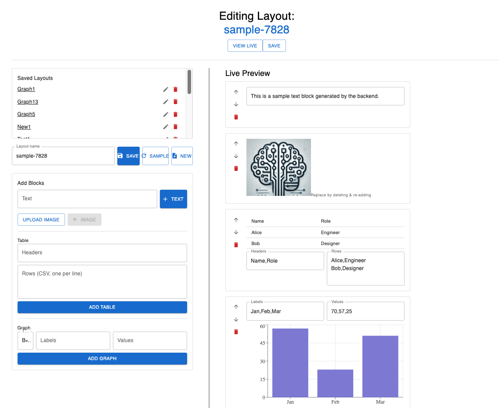

# 🧾 Custom Reporting App

A lightweight visual report builder that allows users to dynamically create layouts composed of text, images, tables, and graphs—then preview, edit, and save them for live viewing.

## 🚀 Getting Started

### Requirements

- Python 3.9+
- Node.js 16+
- Bash (for `run.sh`)
- SQLite (default DB)

### Setup Instructions

```bash
# Clone the repo
git clone https://github.com/dlanoff/custom_reporter.git
cd custom_reporter 

# Start the app (frontend + backend)
chmod +x run.sh
./run.sh
```

Or start manually:

1. Backend (FastAPI)
# Create and activate virtual environment
python3 -m venv venv
source venv/bin/activate  # On Windows: venv\Scripts\activate

# Install dependencies
pip install -r requirements.txt

# Start backend server
uvicorn main:app --reload
This will start the FastAPI backend on http://localhost:8000.

2. Frontend (React)
cd frontend

# Install Node dependencies
npm install

# Start React dev server
npm start
The frontend will launch on http://localhost:3000.


The app will launch:
- Backend at http://localhost:8000
- Frontend at http://localhost:3000

> 🧪 To run backend tests:  
> `python test_app.py`

## 🧩 Features

- Create, edit, delete named layouts
- Add dynamic content blocks: text, images, table, graph (bar/line)
- Move blocks up/down, delete individually
- Save and persist layouts
- Preview layouts in live mode
- Load randomly generated sample report
- Frontend built with React + Material UI
- Backend built with FastAPI

## 📁 Project Structure

```
.
├── main.py               # FastAPI entry point
├── models.py             # SQLAlchemy models
├── database.py           # DB setup
├── schemas.py            # Pydantic models
├── frontend/             # React app (MUI, recharts)
├── test_app.py           # Backend unit tests
├── run.sh                # Starts backend and frontend together
└── requirements.txt
```

## ✅ Reflection & Notes

### Process Summary

I began by scaffolding the backend with FastAPI, using SQLite for simplicity and quick testing. I created the layout and component models and a basic `/layouts` POST/GET routes.

Next, I built a minimal React frontend to fetch and create layouts. As complexity grew, I added dynamic block types (text, image, table, graph) and edit functionality, using Material UI to scaffold the layout editor and preview quickly.


Some key decision points:
- Switched to storing tabular data as array-of-objects/JSON for speed of implementation, sacrificing normalized schema structure
- Built a sample data generator on the backend for easier demoing instead of FE implementation

### Are you happy with your solution?

Yes—for a 4 hour timed build, I’m happy with the completeness and polish. It’s functional, modular, and easy to extend. If allotted more time I would make more comprehensive tests for BE and FE.

### What would you do differently?

- Normalize table/graph data on the backend for relational integrity
- Add user login, image storage using S3, or similar
- Add drag-and-drop for block positioning, also add horizontal positioning
- Add support for importing .csv/various spreadsheet file types
- Add frontend tests

### Where did you get stuck?

A couple of moments:
- Initially ran into issues by closing the database session too early—accessing model attributes afterward caused errors. Fixed by ensuring all needed data was read before closing the session.
- Chart rendering failed due to type mismatch (fixed by standardizing graph config)
- Deciding between PUT vs. POST on rename led to confusion; resolved via `editMode` and fallback "upsert"
- Initial `run.sh` blocked terminal; backgrounding + port conflict cleanup resolved it

## 🖼 Demo

